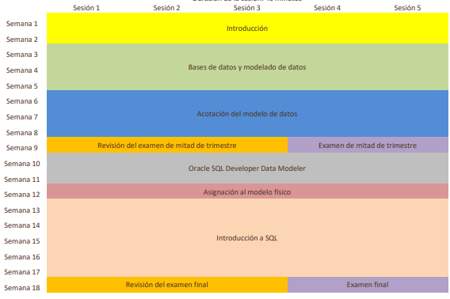

# Recursos del Curso

## Directrices para Fundamentos de bases de datos

## Objetivos del curso

### Visión general
Este curso ofrece a los alumnos una introducción a los conceptos básicos de las bases de datos relacionales. El curso enseña a los alumnos terminología de las bases de datos relacionales, así como conceptos del modelado de datos, la creación de diagramas de relación de entidad (ERD) y la asignación de ERD. Oracle SQL Developer Data Modeler se utiliza para crear ERD y el lenguaje de consulta estructurado (SQL) se utiliza para interactuar con una base de datos relacional y manipular datos de la base de datos. Oracle Application Express se utiliza para proporcionar actividades prácticas y participativas. Al aprovechar las técnicas de aprendizaje basadas en el proyecto, los alumnos crearán y trabajarán con proyectos que les retan a diseñar, implantar y demostrar una solución de base de datos para una empresa u organización.

### Idiomas del plan de estudios disponibles:
- Árabe, chino simplificado, inglés, francés, japonés, portugués brasileño, ruso, español, indonesio

### Duración
- Duración total del curso recomendada: 90 horas*
- Horas de créditos de formación profesional para los educadores que completan la formación de Oracle Academy: 30

> La duración del curso incluye fase de instrucción, autoestudio/deberes, prácticas, proyectos y evaluación.

### Asistentes
**Educadores**
- Técnicos, educadores de formación profesional y miembros del profesorado de universidades y escuelas superiores de titulaciones de 2 y 4 años que imparten clases de ciencias de la computación, tecnología de comunicaciones de la información (ICT), ciencia de datos, empresa o una asignatura relacionada.
- Profesores de secundaria y formación profesional que imparten clases de ciencias de la computación, ICT o una asignatura relacionada.

**Alumnos**
- Alumnos que desean aprender las técnicas y herramientas para diseñar, crear y extraer información de una base de datos.
- Alumnos que poseen habilidades básicas para las matemáticas, la lógica y la solución de problemas analíticos.
- Programadores con poca experiencia, así como aquellos de niveles avanzados, que prefieren aprender la base del lenguaje de programación SQL a un nivel introductorio.
- Este curso sobre conceptos fundamentales es adecuado tanto para los estudiantes de ciencias de la computación como para usuarios que no estudian esta disciplina.

Requisitos previos

**Necesarios**
- Conocimientos generales del objetivo de una base de datos

**Recomendados**
- Experiencia previa con una aplicación de base de datos

**Próximos cursos sugeridos**
- Diseño y programación de bases de datos con SQL

## Temas lección por lección y objetivos

### Sección 1: Introducción

- **1-1 Introducción al curso**
    - Identificar los objetivos del curso y su finalidad
    - Describir la estrategia de aprendizaje del curso
    - Comprender el entorno del curso

- **1-2 Introducción a las bases de datos**
    - Diferenciar entre datos e información
    - Definir una base de datos
    - Describir los elementos de un sistema de gestión de base de datos (DBMS)
    - Identificar las transformaciones en la computación
    - Identificar ejemplos de negocio y de sectores donde se utilizan las aplicaciones de base de datos

- **1-3 Tipos de modelos de bases de datos**
    - Describir el proceso de desarrollo de bases de datos
    - Explicar los tipos comunes de modelos de bases de datos:
        - Modelo de archivo plano
        - Modelo jerárquico
        - Modelo de red
        - Modelo orientado al objeto
        - Modelo relacional

- **1-4 Requisitos de negocio**
    - Explicar la necesidad de una solución de base de datos
    - Describir la importancia de las reglas de negocio
    - Identificar las directrices y ejemplos de escritura de reglas de negocio
    - Explicar la importancia de comunicar claramente y captar de forma precisa los requisitos de información

### Sección 2: Bases de datos y modelado de datos

- **2-1 Bases de datos relacionales**
    - Describir las funciones de una tabla única
    - Describir las funciones y reglas de una base de datos relacional
    - Describir las ventajas e inconvenientes de los tipos de bases de datos
    - Definir tablas relacionales y términos clave

- **2-2 Modelos de datos conceptuales y físicos**
    - Describir un modelo de datos conceptual
    - Describir un modelo de datos lógico
    - Describir un modelo de datos físico
    - Analizar las similitudes y diferencias entre los modelos de datos conceptuales y físicos

- **2-3 Entidades y atributos**
    - Identificar entidades
    - Identificar atributos
    - Identificar atributos obligatorios, opcionales, volátiles y no volátiles
    - Describir las notaciones Barker, Bachman y de ingeniería de la información

- **2-4 Identificadores únicos**
    - Identificar los identificadores únicos (UID)
    - Identificar los identificadores únicos artificiales
    - Identificar los identificadores únicos compuestos
    - Identificar los identificadores únicos candidatos y secundarios
    - Definir llaves primarias

- **2-5 Relaciones**
    - Definir y reconocer ejemplos de relaciones y las correspondientes claves foráneas
    - Identificar las opciones de las relaciones
    - Identificar la cardinalidad de las relaciones
    - Tipos de relaciones
    - Matriz de relaciones

- **2-6 Modelado de relación de entidades (ERD)**
    - Describir el modelado de datos
    - Explicar el término "sin implantación" cuando está relacionado con los modelos de datos y la implantación del diseño  de base de datos
    - Enumerar los cuatro objetivos del modelado de relación de entidad
    - Identificar un diagrama de relación de entidad (ERD)
    - Asignación de relaciones con ERDish
    - Crear componentes de ERD que representan entidades y atributos según las convenciones para la creación de diagramas

### Sección 3: Acotación del modelo de datos

- **3-1 Más sobre las relaciones**
    - Resolver relaciones M:M
    - Identificar relaciones de bloqueo
    - Identificar e ilustrar relaciones intrasferibles
    - Identificar y representar las entidades supertipo y subtipo
    - Identificar relaciones jerárquicas, recursivas y de arco

- **3-2 Seguimiento de los cambios de datos**
    - Realizar un seguimiento de los datos que cambian a lo largo del tiempo

- **3-3 Reglas de negocio y normalización**
    - Explicar la normalización
    - Describir los formatos normales
    - Utilizar la normalización para validar los datos
    - Describir reglas de negocio

- **3-4 Asignación y terminología del modelado de datos**
    - Aplicar la asignación de terminología entre los modelos lógicos y físicos
    - Comprender y aplicar las reglas de nomenclatura de Oracle para tablas y columnas utilizadas en los modelos físicos
    - Aplicar las reglas de asignación de relaciones para transformar las relaciones correctamente

### Sección 4: Oracle SQL Developer Data Modeler

- **4-1 Oracle SQL Developer Data Modeler**
    - Utilizar Oracle SQL Developer Data Modeler para crear:
        - Entidades, atributos y UID con la opcionalidad y la cardinalidad correctas
        - Entidades supertipo y subtipo
        - Relaciones de arco, jerárquicas, de bloqueo y recursivas

- 4-2 Conversión de un modelo lógico en un modelo relacional
    - Describir cómo convertir un modelo lógico en un modelo relacional en Oracle SQL Developer Data Modeler
    - Enumerar los pasos para convertir un modelo lógico en un modelo relacional
    - Enumerar los pasos para convertir un modelo relacional en un modelo lógico en Oracle SQL Developer Data Modeler

### Sección 5: Asignación al modelo físico

- **5-1 Asignación de entidades y atributos**
    - Explicar las convenciones de nomenclatura utilizadas en una base de datos relacional.
    - Utilizar Oracle SQL Developer Data Modeler para crear un glosario y aplicar los estándares de nomenclatura para
        - Asignar entidades a nombres de tabla
        - Asignar atributos a nombres de columna

- **5-2 Asignación de llaves primarias y ajenas**
    - Decidir reglas de nomenclatura para:
        - Nombres de restricción de llave primaria
        - Nombres de restricción de clave foránea
        - Nombres de columna de clave foránea

### Sección 6: Introducción a SQL

- **6-1 Introducción a Oracle Application Express**
    - Distinguir entre software de aplicación y software del sistema y dar un ejemplo de cada uno
    - Conectarse al entorno de práctica de Oracle Application Express
    - Ejecutar una consulta simple para recuperar información de la base de datos
- 
- **6-2 Lenguaje de consulta estructurado (SQL)**
    - Describir cómo se organizan los datos en una base de datos relacional
    - Explicar las distintas terminologías de bases de datos relacionales
    - Definir el lenguaje de consulta estructurado y sus funciones
    - Describir cómo se produce el procesamiento SQL
    - Identificar las herramientas que se utilizan para acceder a la base de datos relacional

- **6-3 Lenguaje de definición de datos (DDL)**
    - Identificar los pasos necesarios para crear tablas de base de datos
    - Describir la finalidad del lenguaje de definición de datos (DDL)
    - Mostrar las operaciones DDL necesarias para crear y mantener las tablas de una base de datos

- **6-4 Lenguaje de manipulación de datos (DML)**
    - Describir la finalidad del lenguaje de manipulación de datos (DML)
    - Explicar las operaciones DML que son necesarias para gestionar los datos de tabla de una base de datos:
        - Insertar
        - Actualizar
        - Suprimir

- **6-5 Lenguaje de control de transacciones (TCL)**
    - Describir la finalidad del lenguaje de control de transacciones (TCL)
    - Explicar las operaciones TCL que son necesarias para gestionar una transacción:
        - COMMIT
        - SAVEPOINT
        - ROLLBACK
    - Describir la necesidad de consistencia de lectura

- **6-6 Recuperación de datos mediante SELECT**
    - Enumerar las capacidades de las sentencias SQL SELECT
    - Escribir y ejecutar una sentencia SELECT que:
        - Devuelva todas las filas y columnas de una tabla
        - Devuelva columnas específicas de una tabla
        - Utilice alias de columna para mostrar cabeceras de columna descriptivas
        - Utilice operadores aritméticos y de concatenación
        - Utilice cadenas de caracteres literales
        - Elimine filas duplicadas
    - Describa la estructura de una tabla

- **6-7 Restricción de datos mediante WHERE**
    - Limitar filas con:
        - Cláusula WHERE
        - Operadores de comparación que utilizan las condiciones =, <=,>=, <>,>,<, !=,^=, BETWEEN, IN,LIKE y NULL
        - Condiciones lógicas que utilizan los operadores AND, OR y NOT
    - Describir las reglas de prioridad de los operadores en una expresión

- **6-8 Ordenamiento de datos mediante ORDER BY**
    - Usar la cláusula ORDER BY para ordenar los resultados de las consultas SQL
    - Identificar la ubicación correcta de la cláusula ORDER BY dentro de una sentencia SELECT
    - Utilizar ROWNUM para análisis de N principales
    -Utilizar variables de sustitución en la cláusula WHERE

- **6-9 Unión de Tablas mediante JOIN**
    - Escribir sentencias SELECT para acceder a datos de más de una tabla mediante uniones igualitarias y no igualitarias
    - Utilizar una autounión para unir una tabla a sí misma
    - Utilizar datos de vista de uniones OUTER que normalmente no cumplen una condición de unión
    - Generar un producto cartesiano (unión cruzada) de todas las filas de dos o más tablas

Copyright © 2020, Oracle y/o sus filiales. Todos los derechos reservados. Oracle y Java son marcas comerciales registradas de Oracle y/o sus filiales. Todos los demás nombres pueden ser marcas
comerciales de sus respectivos propietarios