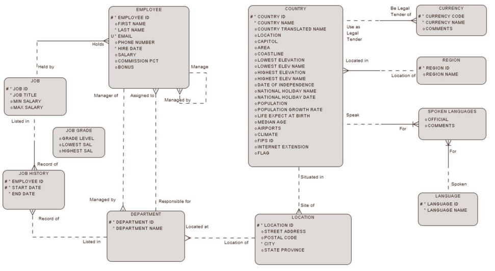
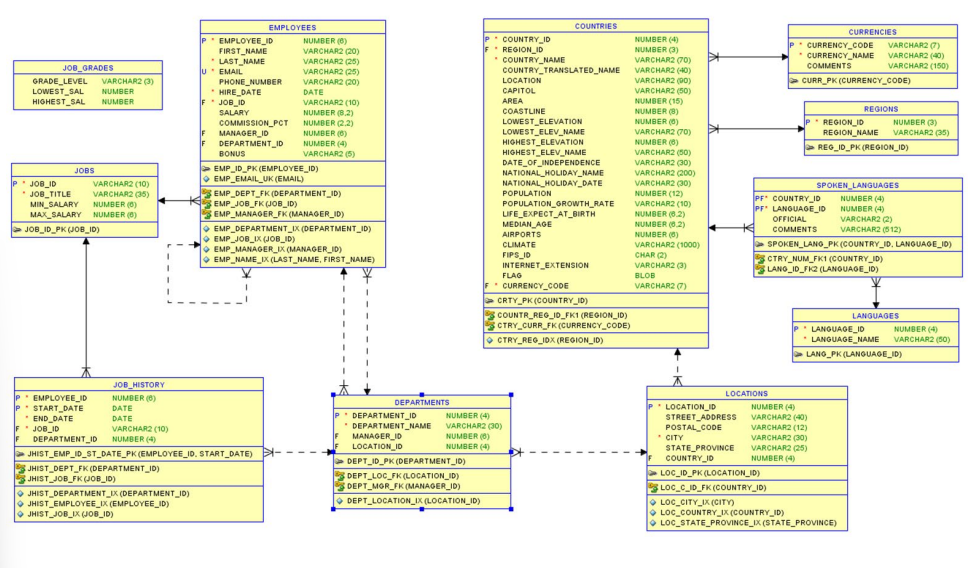
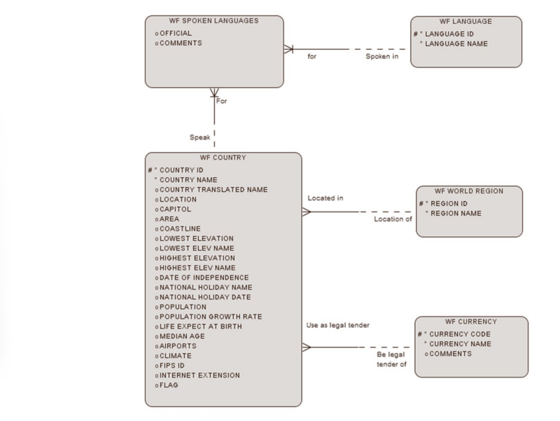
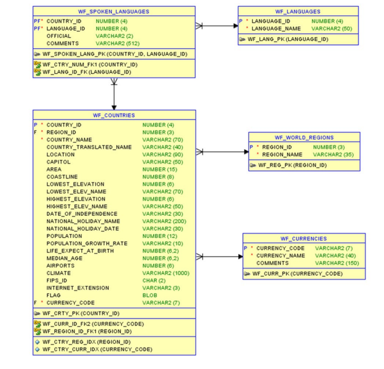
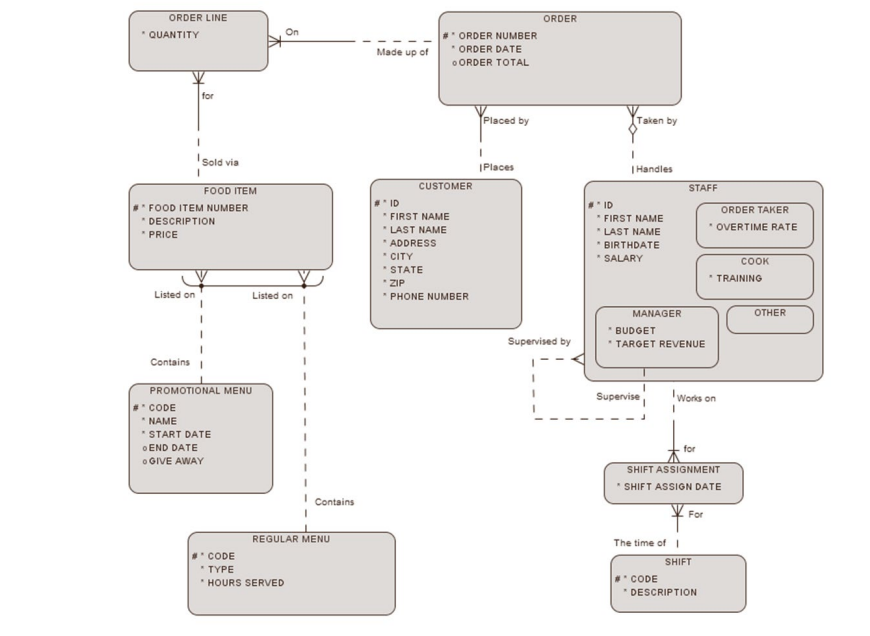
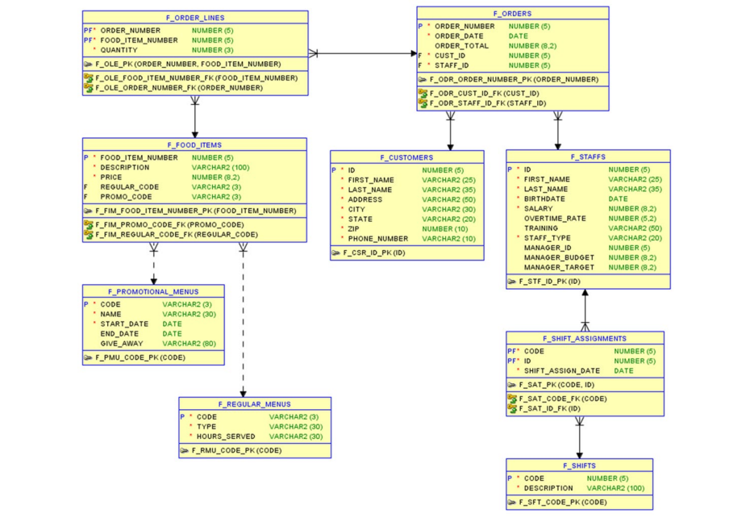
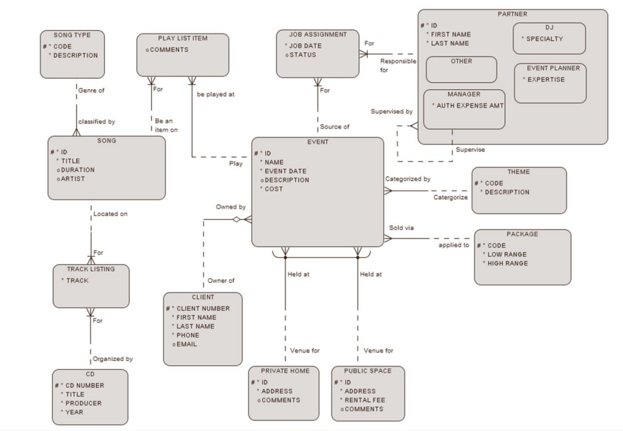
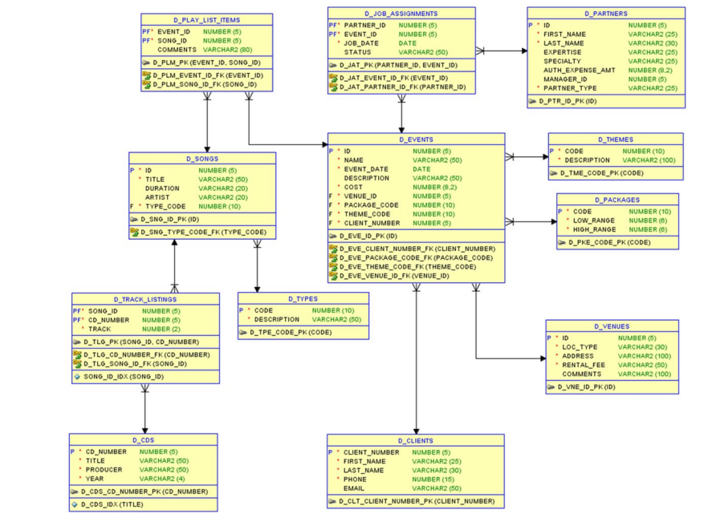

# SQL Esquema y diseños de tabla

A continuación se muestran los esquemas y diseño de las tablas que se crearon con los ejercicios de [SQL_Schema.sql](/Resources/SQL_Schema.sql)

## Employees/departments 

**ERD**

**Table Design**

## wf countries 

**ERD**

**Table Design**

## Global Fast Foods 

**ERD**

**Table Design**

## DJ's on Demand 

**ERD**

**Table Design**

 

Copyright © 2026, Oracle and/or its affiliates. Oracle®, Java, MySQL and NetSuite are registered trademarks of Oracle and/or its affiliates. Other names may be trademarks of their respective owners