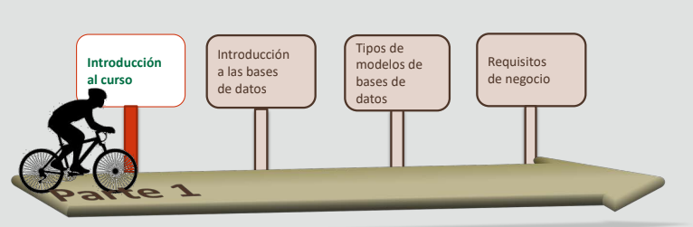
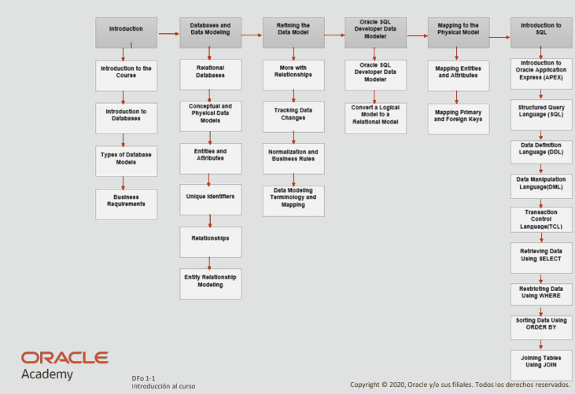

# 1-1 Introducción al curso

## Hoja de ruta

## Objetivos

1. En esta lección se abordan los siguientes objetivos:
    - Identificar los objetivos del curso y su finalidad
    - Describir la estrategia de aprendizaje del curso
    - Comprender el entorno del curso

2. Descrbir objetivo, requisitos y modelado:
    - Describir el objetivo de una base de datos relacional
    - Describir los requisitos de negocio clave al desarrollar una
    base de datos.
    - Utilizar el modelado de datos para diseñar una base de datos
    relacional.

3. Desarrollo de Diagramas:
    - Desarrollar un diagrama de relación de entidad (ERD) para
    modelar datos
    - Utilizar Oracle SQL Developer Data Modeler para crear ERD
    - Asignar un modelo físico a partir de un ERD

4. Crear un modelo físico a partir de un modelo
lógico (ERD).

5. Escribir, ejecutar y guardar sentencias SQL en Oracle
Application Express.

## Esquema

