# 1-2 Introducción a las bases de datos

## Hoja de ruta

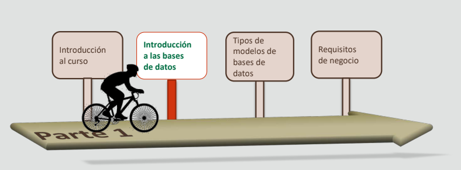

## Objetivos

- En esta lección se abordan los siguientes objetivos:
    - Diferenciar entre datos e información
    - Definir una base de datos
    - Describir los elementos de un sistema de gestión de base de
    datos (DBMS)
    - Identificar las transformaciones en la computación
    - Identificar ejemplos de negocio y de sectores donde se
    utilizan las aplicaciones de base de datos

## Escenario de caso: Datos frente a información

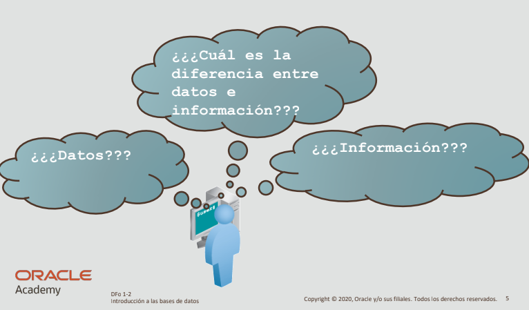

**Datos**:
- Hechos recopilados
sobre un tema o elemento

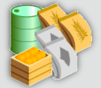

**Información**:
- Resultado de la combinación, comparación y realización de cálculos de los datos.

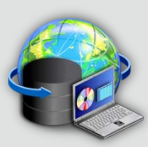

### Ejemplo

La diferencia entre datos e información se puede explicar mediante un ejemplo como el de las puntuaciones en las pruebas. En una clase, si cada alumno recibe una puntuación numerada, se pueden calcular las puntuaciones para determinar la media de la clase. Se pueden calcular las medias de las clases para determinar la media de la escuela. Por lo tanto, en este supuesto, ¿cómo se puede distinguir entre datos e información?

**Para los datos**, la puntuación en la prueba de cada alumno es una parte de los datos.

**La información** es la puntuación media de la clase o la puntuación media de la escuela.

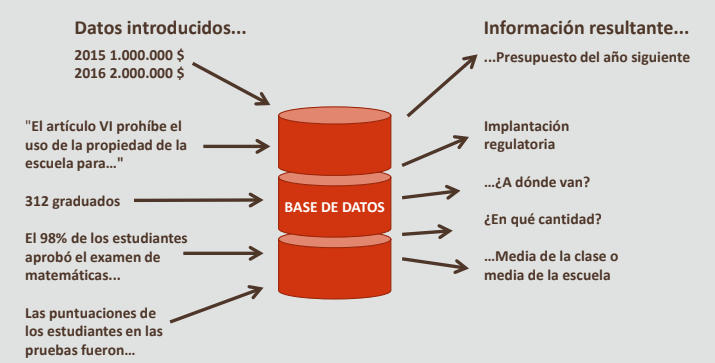

## Definición de base de datos

- Es un conjunto estructurado y centralizado
de datos almacenados en un sistema de computadoras
- Proporciona los medios para recuperar, agregar,
modificar y suprimir los datos cuando sea necesario
- Proporciona los medios para transformar los datos
recuperados en información útil

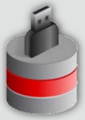

## Introducción a las bases de datos relacionales

Toda organización necesita recopilar y mantener datos para satisfacer sus necesidades. Un sistema de información se puede definir como un sistema formal para almacenar y procesar datos. La mayoría de las organizaciones utiliza en la actualidad una base de datos para automatizar sus sistemas de información. Una base de datos es una recopilación organizada de datos que se trata como una unidad. El objetivo de una base de datos es recopilar, almacenar y recuperar datos relacionados para su uso por parte de las aplicaciones de base de datos. Una aplicación de base de datos es un programa de software que interactúa con una base de datos para acceder a los datos y manipularlos. Normalmente, una base de datos está gestionada por un administrador de bases de datos (DBA).

- Una base de datos relacional almacena la información
en tablas con filas y columnas
- Una tabla es una recopilación de registros
- Una fila se denomina registro (o instancia)
- Una columna se denomina campo (o atributo)

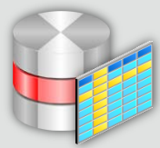

### Ejemplo de base de datos relacional

A continuación se muestran dos tablas: Order Details y Customer. Las tablas están relacionadas entre sí por un atributo común, ID y Customer ID.

Imagine un único pedido realizado por un cliente. Cada pedido contendrá uno o más detalles del pedido. Cada detalle estará relacionado con un cliente.

Los datos proporcionan información sobre los detalles de los pedidos realizados por los clientes. Por ejemplo, la compañía podría recopilar información sobre productos que se suelen adquirir en conjunto. Los paquetes de productos podrían ofrecerse para optimizar la comercialización de los productos para los clientes.

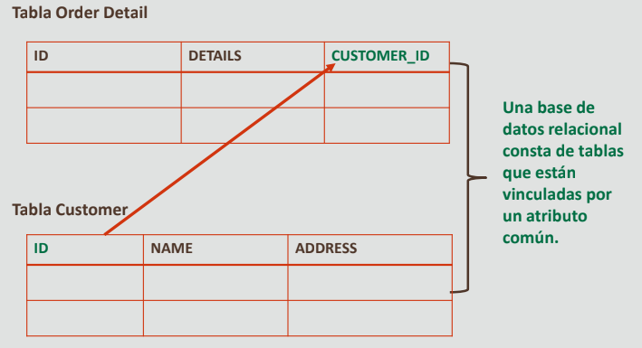

## Sistema de gestión de bases de datos

Un DBMS es el software que controla el almacenamiento, la organización y la recuperación de
datos. Tiene los siguientes elementos:

- El código de núcleo gestiona la memoria y el almacenamiento para el DBMS.
- El repositorio de metadatos se denomina diccionario de datos.
- El lenguaje de consulta permite que las aplicaciones accedan a los datos.

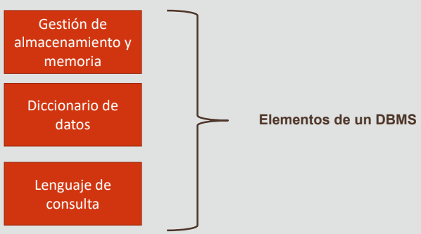

### Términos de computación clave

En el campo de la computación, estos son algunos delos términos clave:
- **Hardware**: parte física de un ordenador
- **Software**: instrucciones que indican al hardware lo que
debe hacer
- **Sistema operativo**: software que controla directamente
el hardware
- **Aplicación**: realiza una tarea específica
- **Cliente**: la estación de trabajo que utilizan los usuarios finales
- **Servidor**: acepta trabajo que necesita más control por
parte de los clientes

## Escenario de caso: Transformación en la computación

Ha habido muchísimos cambios en el campo de la computación.
¿Cuáles son y cuándo se han producido?

Las primeras aplicaciones informáticas se centraban en las tareas de oficina por naturaleza; por ejemplo, nóminas, contabilidad e inventario. Estas aplicaciones accedían a los datos almacenados en los archivos de la computadora, convertían los datos en información significativa y generaban informes para cumplir las necesidades de la organización. Estos sistemas se denominaban sistemas basados en archivos.
La evolución durante décadas de la tecnología de computación, junto con las necesidades y demandas de las organizaciones, ha supuesto el desarrollo de una tecnología de base de datos desde los primitivos sistemas basados en archivos hasta los robustos sistemas de base de datos integrados de la actualidad.

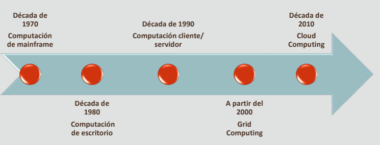

### Década de 1970: Computación de mainframe

En la década de los 70, se intentaron crear sistemas de bases de datos con hardware y software integrados
- Se utilizaban computadoras más pequeñas, o "terminales elementales", para acceder al gran mainframe y ejecutar comandos.
- Los terminales dependían del mainframe y los resultados solo se mostraban una vez completado el procesamiento en el mainframe
- No podían realizar un gran volumen de procesos de forma autónoma

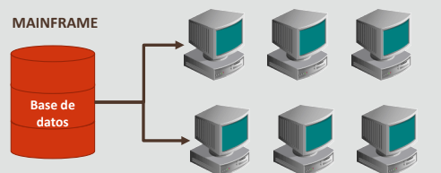

### Década de 1980: Computación de escritorio (procesamiento localizado)

Conforme las computadoras personalesfueron aumentando su velocidad y cada vez más personas podían acceder a ellas, se pasó del procesamiento desde mainframes a los clientes.
- Puesto que las computadoras personales tenían su propio software y eran capaces de realizar algunos procesamientos por sí mismas, se empezaron a denominar "clientes inteligentes" o "estaciones de
trabajo"
- La potencia de procesamiento en la máquina cliente se acomodó en un ciclo de aplicaciones de interfaz gráfica de usuario (GUI). Muchas de las aplicaciones más comunes actualmente (Word, Excel, PowerPoint) se crearon en esta época.

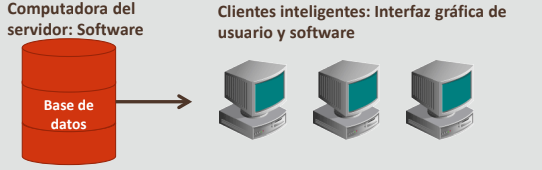

### Década de 1990: Computación cliente/servidor (procesamiento local y centralizado)

La computación cliente/servidor utiliza Internet y los rápidos servidores de procesamiento para satisfacer las necesidades de las organizaciones en cuanto a almacenamiento de datos y producción de información.
- El software que gestiona los datos se encuentra en el servidor de la base de datos,
realiza procesamientos para el almacenamiento y la recuperación.
- Las aplicaciones para operaciones de negocio se encuentran en el servidor de la
aplicación, realiza procesamientos para la creación, el desarrollo y la interacción con
documentos o para la manipulación de los datos.
- Los clientes pueden tener aplicaciones propias, pero a las aplicaciones de negocio
esenciales se accede desde los clientes mediante un explorador de Internet.

El cambio de versión era uno de los problemas que se planteaban con varias aplicaciones en varias estaciones de trabajo de cliente. El cambio de versión en una aplicación de software garantizaba que todos y cada uno de los servidores y clientes tuvieran ese cambio de versión para el grid computing.

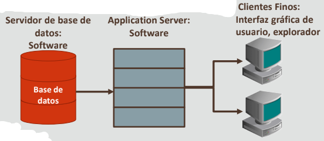

### 1er década de los 2000: Grid computing (procesamiento compartido)

- En el modelo de grid computing, todas las computadoras de una organizaciónen diferentes ubicaciones se pueden utilizar como un pool de recursos de computación.
- Grid computing crea una infraestructura de software que se puede ejecutar en un gran número de servidores conectados a la red.
- Un usuario realiza una solicitud de información o de computación a su estación de trabajo y esta solicitud se procesa en algún lugar de la cuadrícula de la forma más eficaz posible.

Grid computing trata la computación como una utilidad, al igual que la compañía eléctrica. No sabe dónde está el generador o la forma en que está conectada la red eléctrica. Tan solo pide electricidad y la obtiene.

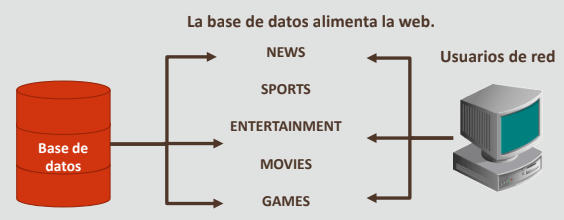

### Después del 2010: Computación en la nube (procesamiento basado en Internet)

- La computación en la nube permite la entrega de servicios de computación a través de
Internet Las tres categorías principales de los servicios en la nube son:
    - IaaS: le permite alquilar sistemas operativos, almacenamiento, servidores basados en la nube, etc
    - PaaS: dan acceso a un entorno en línea para desarrollar y probar software sin costes de gestión o configuración
    - SaaS: proporciona software directamente de Internet. Los usuarios suelen acceder a este servicio mediante un explorador web

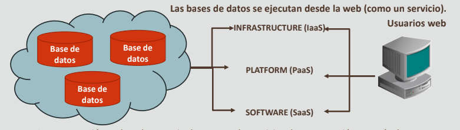

### Historial de la línea de tiempo de la base de datos

| **Año** | **Descripción** |
|---------|-----------------|
| Década de 1960 | Las computadoras se convierten en rentables para las compañías privadas junto con una mayor capacidad de almacenamiento. |
| 1970-72 | E.F. Codd propone el modelo relacional para las bases de datos, desconectando la organización lógica del almacenamiento físico. |
| 1976 | P. Chen propone el modelo de relación de entidad (ERM) para el diseño de la base de datos. |
| Principios de los 80 | Empiezan a aparecer los primeros sistemas de bases de datos relacionales disponibles en el mercado a principios de los años 80 con Oracle Versión 2. |
| Mediados de los 80 | Se extiende el uso de SQL (Lenguaje de consulta estructurado). |
| Década de 1990 | La gran inversión en compañías de Internet ayuda a crear un boom del mercado de herramientas de conectores web/de Internet/de base de datos. |
| Década del 2000 | Continúa el sólido crecimiento de las aplicaciones de base de datos. Ejemplos: sitios web comerciales (yahoo.com, amazon.com), sistemas gubernamentales (Oficina de ciudadanía y servicios de inmigración, Oficina del censo), museos de arte, hospitales, escuelas. |
| Después del 2010 | Los servicios basados en la nube de compañías como Oracle, Apple y Microsoft, además de los AWS de Amazon, han convertido la computación en la nube en un sector multimillonario. |

#### Ejemplos

- Las escuelas y universidades utilizan bases de datos para mantener la información sobre cursos, alumnos y profesores.
- Los bancos utilizan bases de datos para almacenar información sobre clientes, cuentas, préstamos y transacciones.
- Las aerolíneas y compañías de ferrocarril utilizan bases de datos en línea para las reservas y para mostrar información sobre la programación.
- Los departamentos de telecomunicaciones almacenan información en sus bases de datos sobre la red de comunicación, números de teléfono, detalles de llamadas y facturas mensuales.
- En el sector de las finanzas y el comercio, se utilizan las bases de datos para almacenar información referente a las ventas, compras de acciones y obligaciones, o al comercio en línea
- Las organizaciones utilizan las bases de datos para almacenar información sobre sus empleados, salarios, beneficios, impuestos y para generar nómina.
- ¿Se le ocurren más casos en los que se utilizan bases de datos?

Las bases de datos se utilizan:
- Para realizar un seguimiento de las compras con tarjetas de débito y crédito, lo que permite generar balances mensuales.
- Para integrar orígenes de información heterogéneos para actividades relacionadas con el negocio, como compras en línea, reservas de paquetes de vacaciones y consultas médicas.
- En el sector sanitario, para mantener y realizar un seguimiento de los detalles de la asistencia sanitaria a pacientes.
- En el área de la edición digital y bibliotecas digitales, para gestionar y proporcionar datos textuales y multimedia.

## Resumen

- En esta lección, debe haber aprendido lo siguiente:
    - Diferenciar entre datos e información.
    - Definir una base de datos.
    - Describir los elementos de un sistema de gestión de base de datos (DBMS).
    - Identificar las transformaciones en la computación.
    - Identificar ejemplos de negocio y de sectores donde se utilizan las aplicaciones de base de datos.

 

