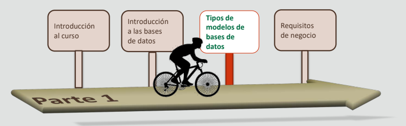
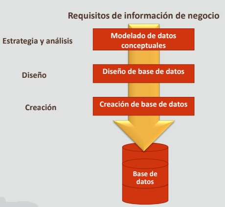
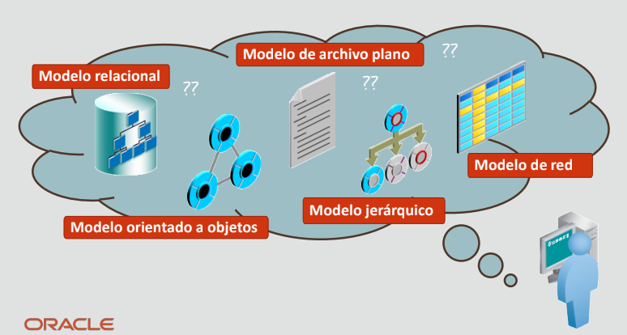
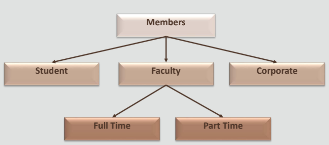
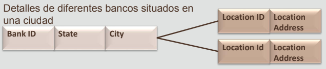
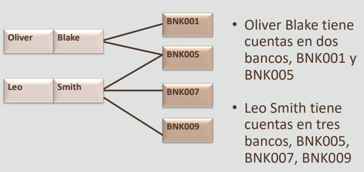
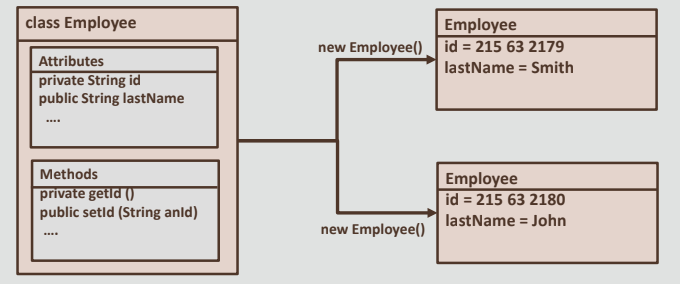
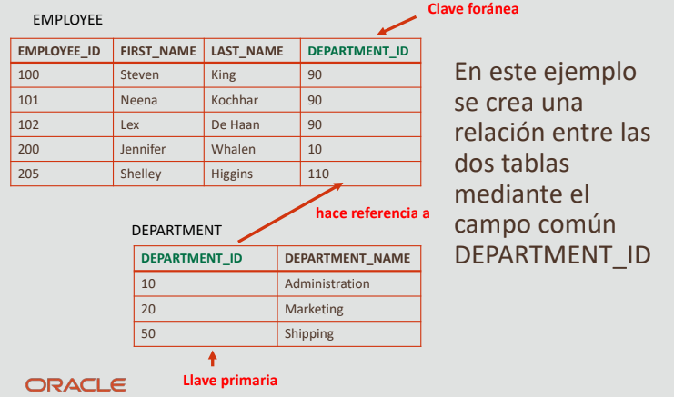

# 1.3 Tipos de modelos de bases de datos

## Hoja de ruta

## Objetivos
- En esta lección se abordan los siguientes objetivos:
    - Describir el proceso de desarrollo de bases
    de datos
    - Explicar los tipos comunes de modelos de bases
    de datos:
        - Modelo de archivo plano
        - Modelo jerárquico
        - Modelo de red
        - Modelo orientado al objeto
        - Modelo relacional

## Proceso de desarrollo de bases de datos

El modelado de datos es la primera parte del proceso de desarrollo de bases de datos. El modelado de datos conceptual es el examen de un negocio y los datos de negocio con el fin de determinar la estructura de la información de negocio y las reglas que la rigen. Esta estructura constituye la base del diseño de la base de datos. Un modelo conceptual es relativamente estable durante largos períodos de tiempo. El modelado de datos físico (o creación de base de datos) está relacionado con la implantación en un software técnico y un entorno de hardware determinados. La implantación física depende en gran medida del estado actual de la tecnología y está sujeta a cambios a medida que cambia rápidamente la tecnología disponible.

### Escenario de caso: Tipos de modelos de bases de datos

**Modelo de archivo plano**
- Una base de datos de archivos planos es una base de datos diseñada en torno a una única tabla
- Las bases de datos de archivos planos están normalmente en texto sin formato, en el que cada línea contiene solo un registro
- Los campos del registro se separan con delimitadores, como tabuladores y/o comas.

**Ejemplo de modelo de archivo plano**

- Los libros, así como los autores, se almacenan en esta tabla única, lo cual causa la repetición de los valores de datos.

|  | AUTHOR_ID | AUTHOR_NAME | TITLE |
|--|-----------|-------------|-------|
Record 1 | AD0001 | Oscar Wilde | A Vision |
Record 2 | AD0002 | Leo Tolstoy | War and Peace |
Record 3 | AD0003 | Oliver Goldsmith | Citizen of the World |
Record 4 | AD0003 | Oliver Goldsmith | The Deserted Village |

Los archivos planos sirven como solución para tareas de base de datos simples. El diseño del archivo plano incluye toda la información de la base de datos en una tabla o una lista con campos que representan todos los parámetros. Un archivo plano puede contener varios campos, a menudo con datos duplicados que son propensos a la corrupción de datos.

**Modelo jerárquico**

- En un modelo de base de datos jerárquica, los datos se organizan en una estructura de árbol
- Los datos se almacenan como registros que están conectados entre sí mediante enlaces
- Un registro es una recopilación de campos
- Un registro en el modelo de base de datos jerárquica se corresponde con una fila en el modelo de base de datos relacional

**Ejemplo de modelo jerárquico**
- Los datos se organizan en una estructura de árbol y se almacenan como registros que se conectan entre sí a través de enlaces.

Cada campo solo contiene un valor. El tipo de entidad de un registro define qué campos contiene el registro. Un registro en el modelo de base de datos jerárquica se corresponde con una fila en el modelo de base de datos relacional. Un tipo de entidad se corresponde con una tabla.

En un modelo de base de datos jerárquica:
- Cada registro secundario solo tiene un principal.
- Un registro principal puede tener uno o más registros secundarios.
- Para recuperar datos de una base de datos jerárquica, es necesario recorrer todo el árbol a partir del nodo raíz.

Ventajas:
- Adición y supresión sencilla de la información nueva
- Acceso más rápido a los datos en la parte superior de la jerarquía

Desventajas:
- Se ve aumentado el espacio de almacenamiento
- Acceso más lento a los datos en la parte inferior de la jerarquía

**Modelo de red**

- El modelo de red es un modelo de base de datos que se puede considerar como una forma flexible de representar objetos y sus relaciones
- Una base de datos de red consta de una recopilación de registros conectados entre sí mediante enlaces. (Cuadros = campos, líneas = enlaces)
- Cada registro es una recopilación de campos, cada uno de los cuales contiene solo un valor de datos
- Un enlace es una asociación entre dos registros

**Ejemplo de modelo de red**

En un modelo de base de datos de red, cada registro puede tener varios registros principales y secundarios, formando una estructura de gráfico generalizada. El modelo de red permite una forma más natural de modelar la relación entre registros.

**Modelo orientado a objetos**
- Una entidad se modela como un objeto
- Cada objeto tiene un estado (el juego de valores para los atributos del objeto) y un comportamiento (el juego de métodos que funciona en el estado del objeto)
- La relación entre los objetos se establece compartiendo acceso
- Un objeto debe pertenecer a una sola clase como una instancia de esa clase
- Puede derivar una nueva clase (subclase) de una clase existente (superclase)

**Ejemplo de modelo orientado a objetos**

Ventajas
- Menor mantenimiento
- Modelado del mundo real
- Alta capacidad de reutilización del código

Desventajas
- Muchos sistemas de aplicaciones de información no se benefician del modelado orientado a objetos porque es más adecuado para entornos dinámicos e interactivos.

**Modelo relacional**
- Los datos se representan como una recopilación de tablas
- Cada columna representa los atributos que pertenecen a la tabla
- Cada fila representa una instancia de la tabla
- Cada tabla es la representación visual de las columnas y filas
- Cada tabla tiene un campo o un juego de campos que identifica de forma única la fila
- El orden de las columnas y las filas no es importante.
- Cada fila es única
- Cada campo solo puede contener un valor
- Los valores de una columna o un campo son del mismo dominio (datatype)
- Los nombres de tabla deben ser únicos
- Los nombres de columna dentro de cada tabla deben ser únicos

**Ejemplo de modelo relacional**

En el ejemplo de la diapositiva, la tabla Employees contiene una columna que se relaciona con el valor de Department_ID de la tabla Departments. La inclusión de Department_ID define la relación en el modelo de base de datos relacional.

