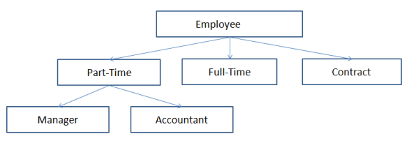
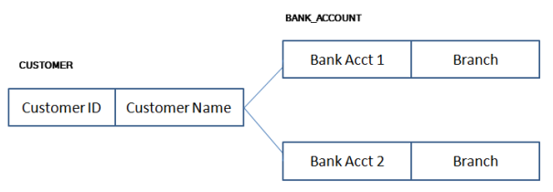
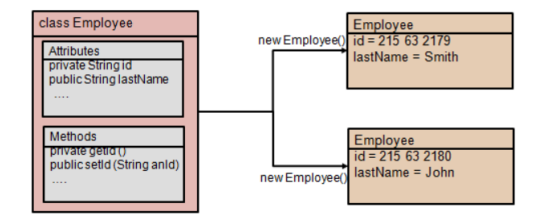
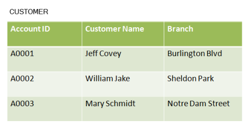
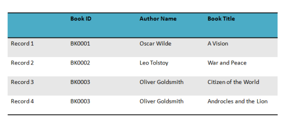

# Fundamentos de bases de datos
## 1-3: Tipos de modos de base de datos

### Prácticas
**Ejercicio 1: Identificar los modelos de bases de datos**

Visión general:

- En esta práctica, tendrá que identificar el tipo de modelo de base de datos representado en las instantáneas proporcionadas del modelo.

## Tareas
1. Identifique el tipo de modelo de base de datos representado en las instantáneas proporcionadas del modelo:

a).

**Respuesta**:  Modelo jerárquico

b).

**Respuesta**: Modelo de red

c).

**Respuesta**: Modelo orientado a objetos

d).

**Respuesta**: Modelo relacional

e).

**Respuesta**: Modelo de archivo plano

#### Esta es la evidencia que corresponde a la <a href="/Seccion_1_Introduccion/1_3_Practicas.md">tarea</a> de la lección <a href="/Seccion_1_Introduccion/1_3_Modelos_de_bases_de_datos.md"> 1.3 Tipos de modelos de bases de datos</a> del curso  Database Foundations de Oracle Academy.

