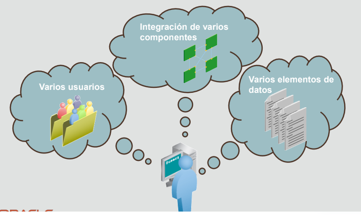
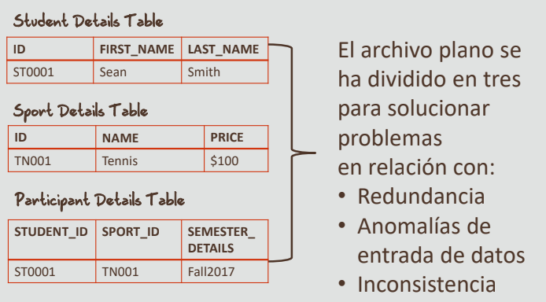
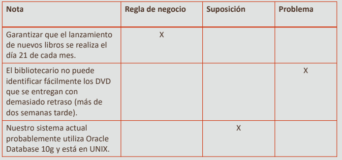

# 1-4 Requisitos de negocio 

## Hoja de ruta

## Objetivos
- En esta lección se abordan los siguientes objetivos:
    - Explicar la necesidad de una solución de base de datos
    - Describir la importancia de las reglas de negocio
    - Identificar las directrices y ejemplos de escritura de reglas de negocio
    - Explicar la importancia de comunicar claramente y captar de forma precisa los requisitos de información

## ¿Por qué necesito una solución de base de datos?

### Escenario de caso: Necesidad de una solución de base de datos

|     | STUDENT_ID | SPORT_1 | PRICE_1 | SPORT_2 | PRICE_2 |
|-----|------------|---------|---------|---------|---------|
|Record 1| ST0001 | Tennis | $100 | Badminton | $150 |
|Record 2| ST0002 | Soccer | $175 | Tennis | $100 |
|Record 3| ST0003 | Cycling| $200 | Badminton | $150 |
|.......| .......| .......| .......|.......| .......|

Se trata de un archivo plano que almacena información sobre los alumnos, los deportes que hayan seleccionad y el precio de cada deporte seleccionado. Este escenario garantiza la necesidad de una base de datos relacional.

**Posible solución de la base de datos**

**Importancia de las reglas de negocio**
- Es importante identificar y documentar las reglas de negocio al diseñar una base de datos
- Reglas de negocio:
    - Permiten al desarrollador/arquitecto comprender la relación y las restricciones de las entidades participantes
    - Ayudan a entender el procedimiento de normalización que sigue una organización al manejar una gran cantidad de datos
    - Deberían ser simples y fáciles de entender
    - Deben mantenerse actualizadas
- Las reglas de negocio se utilizan para comprender los procesos de negocio y la naturaleza, el rol y el ámbito de los datos
- Las reglas de negocio le ayudan a clasificar y diseñar las tablas de la base de datos
-  Por lo general, las reglas de negocio las proporcionan:
    - Gestores
    - Creadores de políticas
    - Manuales de funcionamiento y documentación
    - Estándares y procedimientos de organización
    - Entrevistas con los usuarios finales

**Reglas de negocio y modelado conceptual**
- Un modelo conceptual es importante para un negocio porque:
    - Describe exactamente las necesidades de información del negocio
    - Facilita la comunicación
    - Evita errores y malentendidos
    - Formula documentación importante de "sistema ideal"
    - Crea una base sólida para el diseño de la base de datos física
    - Documenta los procesos (también denominados "reglas de negocio") del negocio
    - Tiene en cuenta las normativas y leyes vigentes en este sector

> Nota: No todas las reglas de negocio se pueden modelar en una base de datos

### Escenario de caso: Identificación de reglas de negocio
- SunStar Online Book Rentals es una exitosa empresa de alquiler de libros. SunStar ve cómo crece el negocio y necesita mejorar su sistema de información para soportar los cambios propuestos para el negocio. SunStar atrae a nuevos clientes de forma fácil y el número de alquileres está creciendo rápidamente. Sin embargo, la base de clientes no es estable, lo que supone un motivo de preocupación.

- La idea principal es presentar tres tipos de inscripciones (oro, plata, bronce), aunque se pueden introducir otros más adelante. La inscripción de bronce es gratuita. Las inscripciones de plata y oro llevan asociada una cuota, pero otorgan privilegios al miembro. El tipo de inscripción no puede cambiarse.

**Solución para identificar reglas de negocio**
- Regla de negocio:
    - Los miembros pagarán las cuotas de inscripción
- Restricción:
    - Los miembros pueden pertenecer a una de las tres categorías de inscripción (oro, plata o bronce)
- Regla de negocio:
    - La inscripción de bronce es gratuita. Las inscripciones de plata y oro llevan asociada una cuota
- Restricción:
    - El tipo de inscripción no puede cambiarse

### Escenario de caso: Identificación de reglas de negocio clave, problemas y suposiciones

- Regla de negocio: Se utilizan para comprender los procesos de negocio y la naturaleza, el rol y el ámbito de los datos.
- Suposición: Se puede definir como un hecho o una afirmación que se dan por sentados
- Problema: Se puede definir como una situación o escenario que requiere atención y una posible solución para solventar la situación

**Solución para la identificación de reglas de negocio clave, problemas y suposiciones**

## Ejercicio del proyecto
**1.4 Project**
- Base de datos de la tienda Oracle Baseball League
- Reglas de negocio

